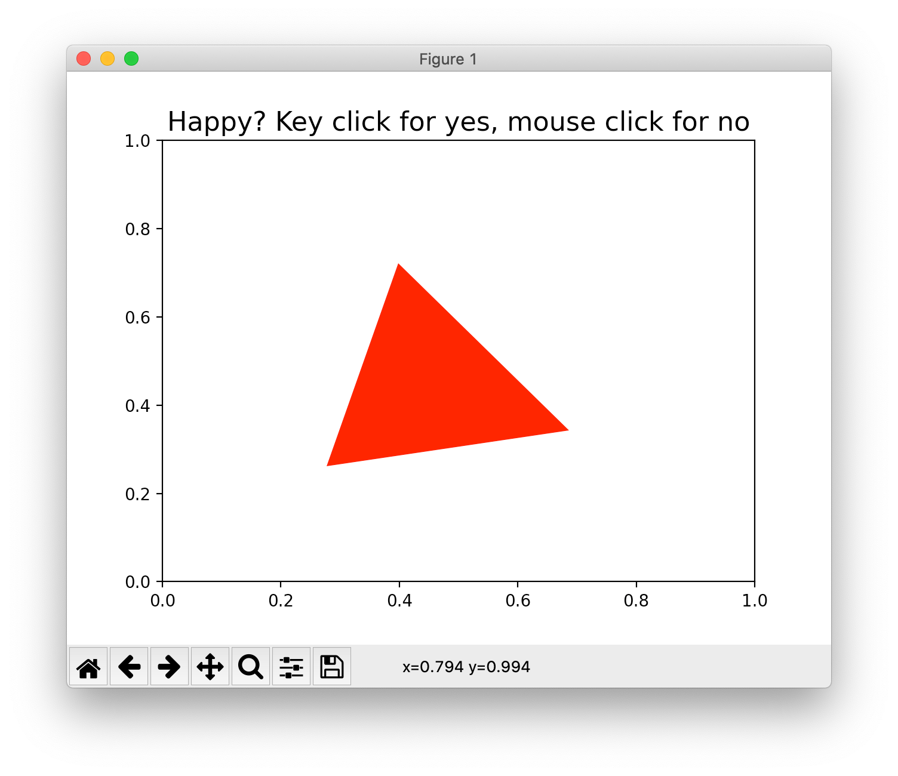
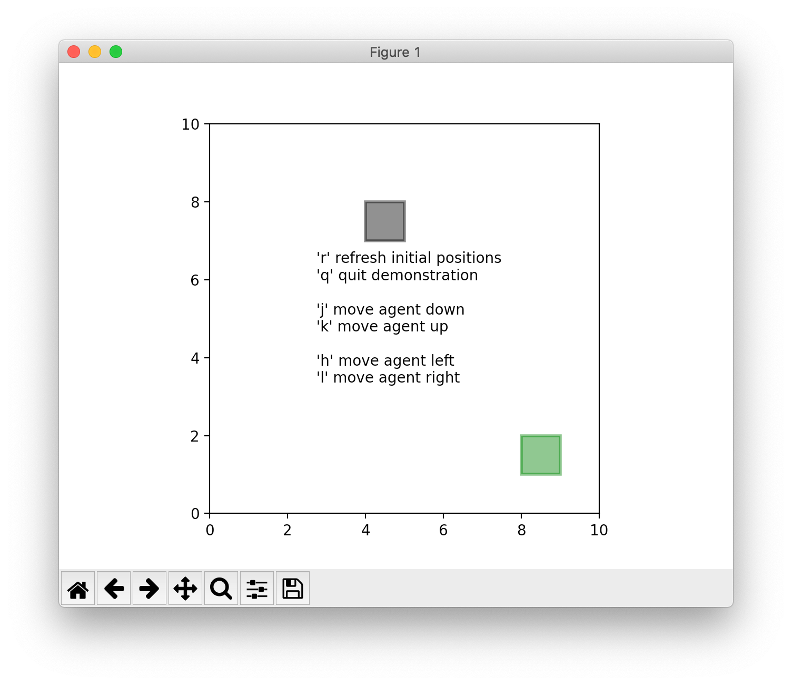

# Pyplot Show

`matplotlib.pyplot.show(*, block=None)` displays (shows) all open figures.

There are two modes:

* **Interactive** 
  * Assures all windows are displayed and return immediately.  User is responsible
  for ensuring the event loop is running to have responsive figures.
* **Non-Interactive** 
  * `block` defaults to `True`
  * Runs the GUI main loop until all windows are closed
  * Figures all display (show) and do not return until all windows are closed

## Examples

### Configuring Font

* `configure_font.py`

### Interactive Functions

* `interactive_functions.py`

### Pong

* `pong.py`

### Agent and Landmark

* `agent_landmark.py`

*To come.*

### Multiprocess

### pyplot with GTK

### Tool Manager

### Lasso Selector

## References

* matplotlib [show](https://matplotlib.org/stable/api/_as_gen/matplotlib.pyplot.show.html) page.
