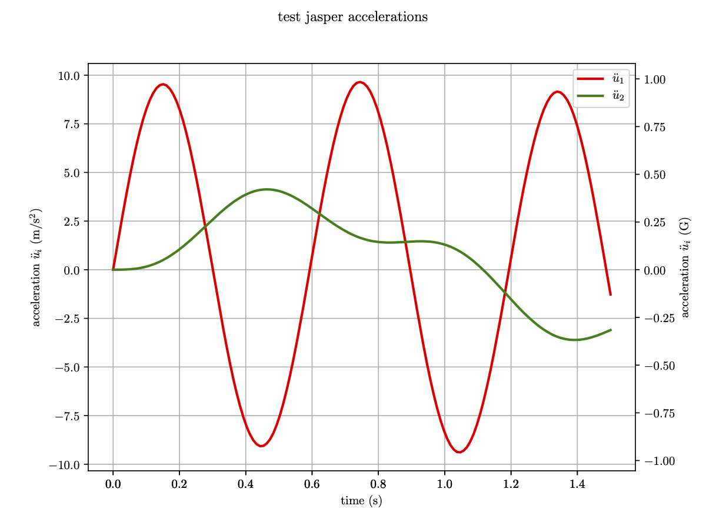
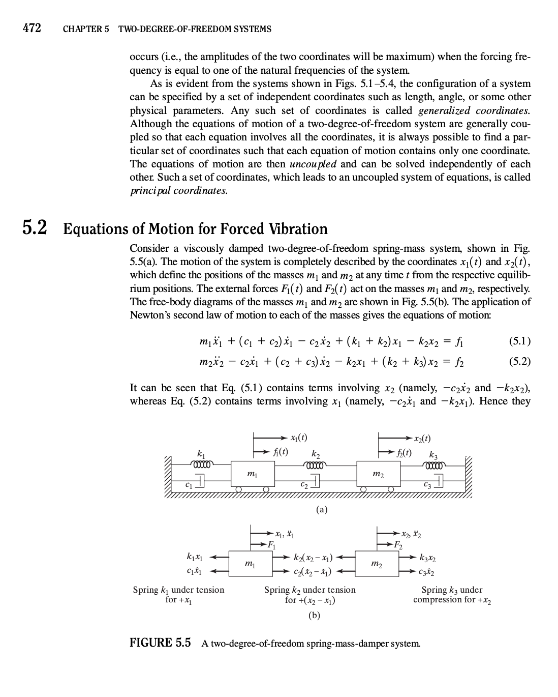
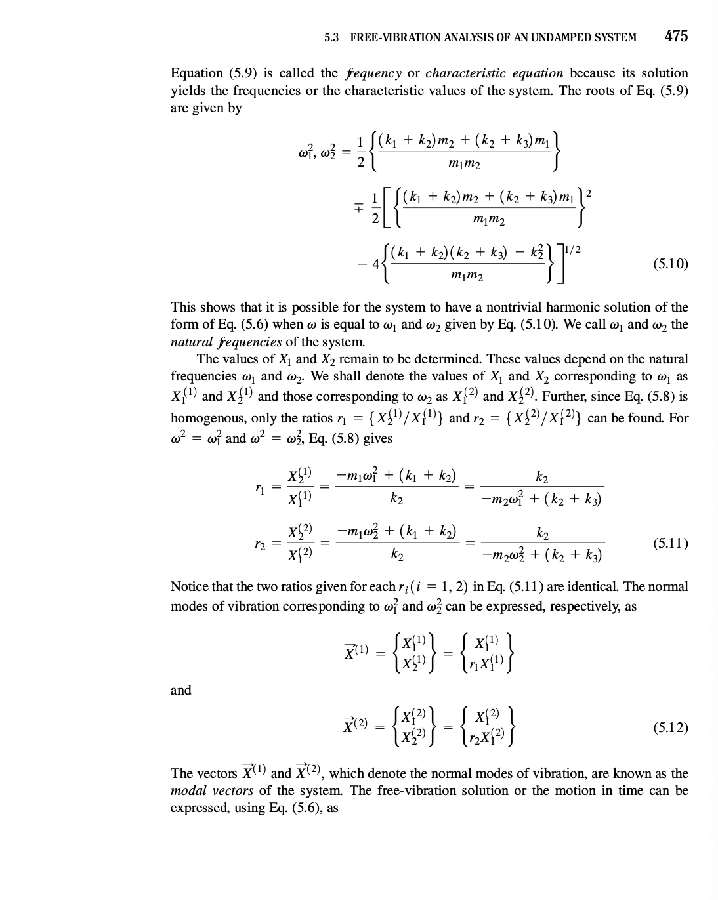
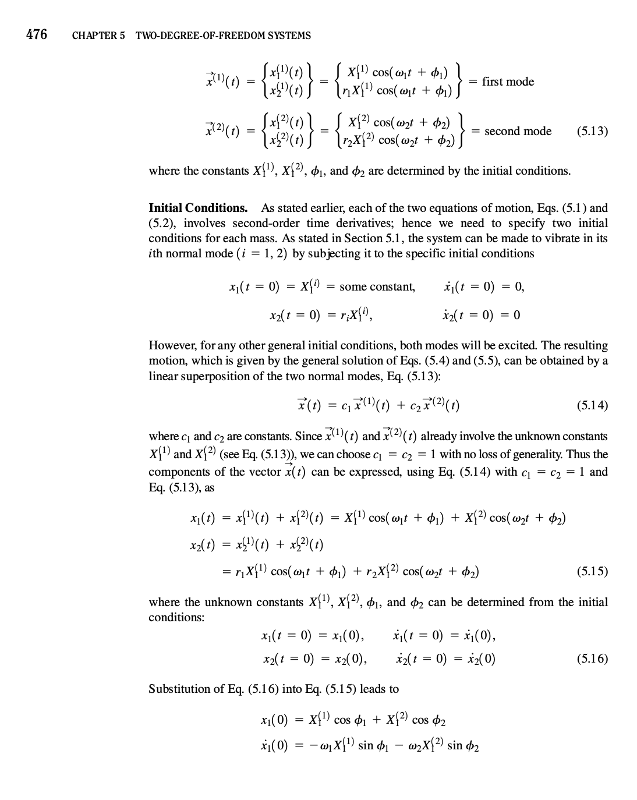
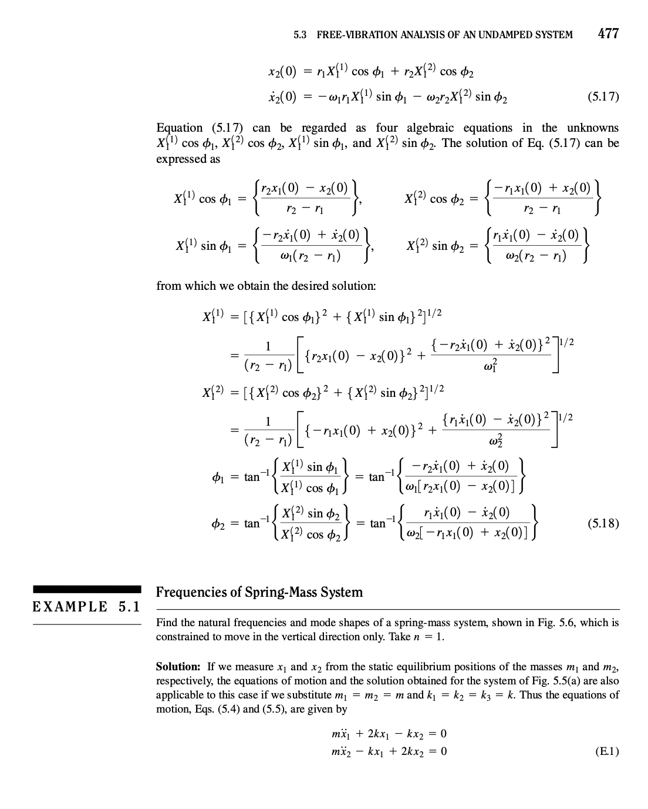

# Oscillator

## Overview 

Reproduce the MATLAB implementation of a two degree-of-freedom oscillator, from the repository `Jasper/vision/script/two_dof_oscillator.m`: 


## Workflow

### Processing

```bash
[~/pyschool/oscillator] $ python client.py test_jasper.json
```

will create the following output files files:

* Saved file: `test_jasper_t_u1.csv`
* Saved file: `test_jasper_t_u2.csv`
* Saved file: `test_jasper_t_u1dot.csv`
* Saved file: `test_jasper_t_u2dot.csv`
* Saved file: `test_jasper_t_u1ddot.csv`
* Saved file: `test_jasper_t_u2ddot.csv`
* Saved file: `test_jasper_t_ke.csv`
* Saved file: `test_jasper_t_ie.csv`
* Saved file: `test_jasper_t_te.csv`

which are degree-of-freedom `1` and `2` displacement, velocity, and acceeleration, and the system energies: kinetic, internal, and total.  

### Post-Processing

To plot `u2ddot` for example, post-processes as 

```bash
[~/pyschool/oscillator] $ python ../xyfigure/XYFigure_client.py test_jasper_uddot.json
```

which will show the figure below, and save it as `test_jasper_uddot.pdf`.



### Parameter Optimization

The goal of parameter optimization is to find spring constants `k_1` and `k_2` given mass parameters `m_1` and `m_2`, and initial conditions `u1_at_0`, `u2_at_0`, `u1dot_at_0`, and `u2dot_at_0`.  

The objective function will be defined as the L2-norm error rate between the acceleration at degree of freedom 2, `uddot_2`, of the simulation versus the experiment.  

As a verification step, prior to the use of real experimental data, the closed-form solution is used as surrogate experimental data.  The optimization algorithm will then seek to find values for `k_1` and `k_2` that minimize the objective function.  

The closed-form solution can be found in Rao 2011, with excerpts below:

> Rao 2011:
> 




The Python script to generate the experimental response, both real and surrogate, is

```bash
$ python client_experiment.py test_jasper.json
```

which will produce

* Saved file: `test_jasper_t_u2ddot_exp_f1.csv`
* Saved file: `test_jasper_t_u2ddot_exp_f2.csv`
* Saved file: `test_jasper_t_u2ddot_exp.csv`

which are the component signal and combined signal.  To post-process

```bash
[~/pyschool/oscillator] $ python ../xyfigure/XYFigure_client.py test_jasper_uddot_exp.json
```

## References

* Gundes YYYY 2dof oscillator
* Jasper repo (private) Jasper/vision/script/two_dof_oscillator.m
* Koumlis 2019 strain rate open cell foam
* Rao 2011 mechanical vibrations 5th edition
* SciPy Cookbook 2018, Coupled spring-mass system, https://scipy-cookbook.readthedocs.io/items/CoupledSpringMassSystem.html, accessed 2019-12-23.
* SciPy odeint, https://docs.scipy.org/doc/scipy/reference/generated/scipy.integrate.odeint.html, accessed 2019-12-23.
* SciPy solve ivp, https://docs.scipy.org/doc/scipy/reference/generated/scipy.integrate.solve_ivp.html#scipy.integrate.solve_ivp, accessed 2019-12-23.
* Zhang 2017 helmet pads experimental characterization

