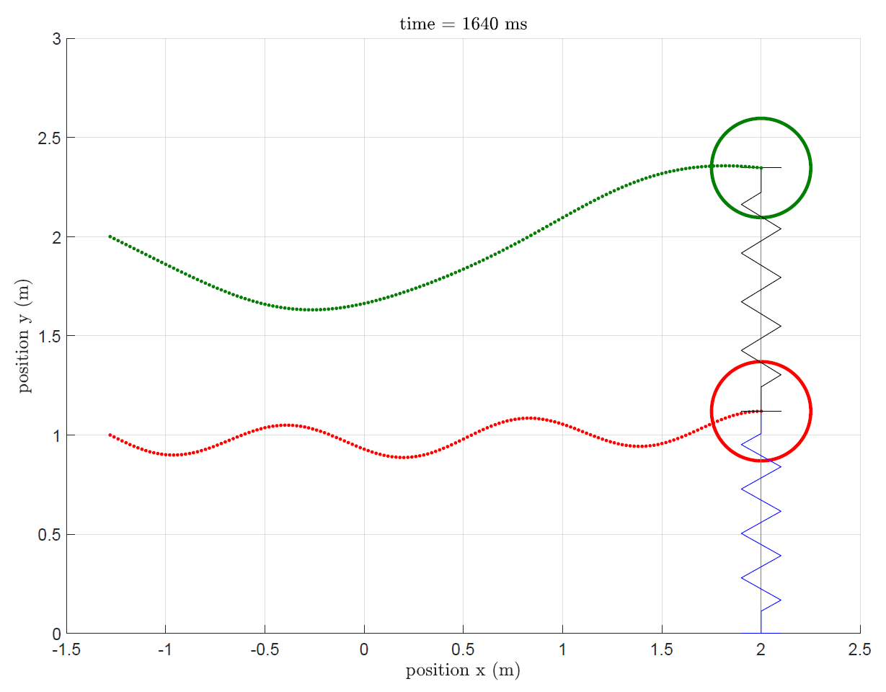

# Oscillator

Reproduce the MATLAB implementation of a two degree-of-freedom oscillator, from the repository `Jasper/vision/script/two_dof_oscillator.m`: 

## References

* Gundes YYYY 2dof oscillator
* Jasper repo (private) Jasper/vision/script/two_dof_oscillator.m
* Koumlis 2019 strain rate open cell foam
* Rao 2011 mechanical vibrations 5th edition
* SciPy Cookbook 2018, Coupled spring-mass system, https://scipy-cookbook.readthedocs.io/items/CoupledSpringMassSystem.html, accessed 2019-12-23.
* SciPy odeint, https://docs.scipy.org/doc/scipy/reference/generated/scipy.integrate.odeint.html, accessed 2019-12-23.
* SciPy solve ivp, https://docs.scipy.org/doc/scipy/reference/generated/scipy.integrate.solve_ivp.html#scipy.integrate.solve_ivp, accessed 2019-12-23.
* Zhang 2017 helmet pads experimental characterization

