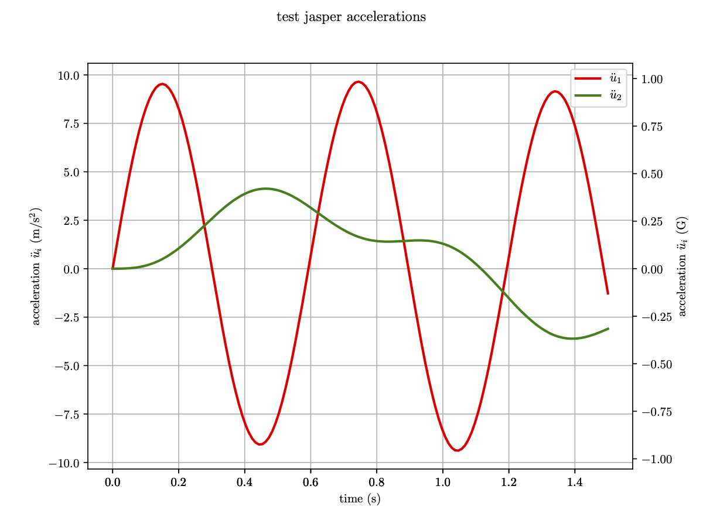

# Oscillator

## Overview 

Reproduce the MATLAB implementation of a two degree-of-freedom oscillator, from the repository `Jasper/vision/script/two_dof_oscillator.m`: 


## Workflow

### Processing

```bash
$ python client.py test_jasper.json
```

will create the following output files files:

* Saved file: `test_jasper_t_u1.csv`
* Saved file: `test_jasper_t_u2.csv`
* Saved file: `test_jasper_t_u1dot.csv`
* Saved file: `test_jasper_t_u2dot.csv`
* Saved file: `test_jasper_t_u1ddot.csv`
* Saved file: `test_jasper_t_u2ddot.csv`
* Saved file: `test_jasper_t_ke.csv`
* Saved file: `test_jasper_t_ie.csv`
* Saved file: `test_jasper_t_te.csv`

which are degree-of-freedom `1` and `2` displacement, velocity, and acceeleration, and the system energies: kinetic, internal, and total.  

### Post-Processing

To plot `u2ddot` for example, post-processes as 

```bash
$ python ../xyfigure/XYFigure_client.py test_jasper_uddot.json
```

which will show the figure below, and save it as `test_jasper_uddot.pdf`.



## References

* Gundes YYYY 2dof oscillator
* Jasper repo (private) Jasper/vision/script/two_dof_oscillator.m
* Koumlis 2019 strain rate open cell foam
* Rao 2011 mechanical vibrations 5th edition
* SciPy Cookbook 2018, Coupled spring-mass system, https://scipy-cookbook.readthedocs.io/items/CoupledSpringMassSystem.html, accessed 2019-12-23.
* SciPy odeint, https://docs.scipy.org/doc/scipy/reference/generated/scipy.integrate.odeint.html, accessed 2019-12-23.
* SciPy solve ivp, https://docs.scipy.org/doc/scipy/reference/generated/scipy.integrate.solve_ivp.html#scipy.integrate.solve_ivp, accessed 2019-12-23.
* Zhang 2017 helmet pads experimental characterization

