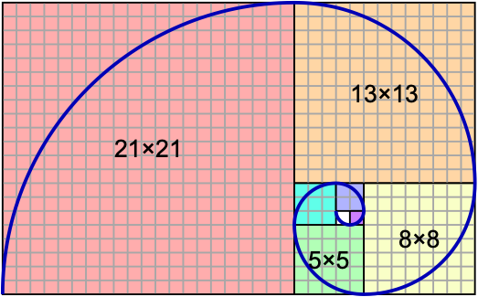

# Cython

## Getting started

Install Cython into your conda environment (example shown on macOS).

```bash
> cwd
/Users/sparta/pyschool/src/pyschool/cython
>
> conda activate pyschool-env
> pip install cython           (pyschool-env) 119ms  Fri Oct  1 10:55:17 2021
Collecting cython
  Downloading Cython-0.29.24-cp38-cp38-macosx_10_9_x86_64.whl (1.9 MB)
     |████████████████████████████████| 1.9 MB 1.6 MB/s
Installing collected packages: cython
Successfully installed cython-0.29.24
⋊> ~/p/s/p/cython on master ⨯
```

If you use VS Code, you may want to install [Language-Cython](https://marketplace.visualstudio.com/items?itemName=guyskk.language-cython&ssr=false#overview) for syntax highlighting of `.pyx` files.

Install a compiler if one doesn't already exist:

* Linux already has a compiler `gcc`
* Mac already has a compiler `gcc` (from Apple's [Xcode](https://developer.apple.com/xcode/))
* Windows `mingw`

## Function declarations

Cython declares functions using one of three keywords: `def`, `cdef`, and `cpdef`.

* `def` is the pure Python variant:
  * Python is used to call the function.
  * The function arguments are Python objects.
  * The function returns a Python object.
* `cdef` is used as a pure `C` variant:
  * `C` will be used to call the function.
  * The function argments must have typed declarations.
  * The function return should have a type declaration.
  * The created `C` function will fastest variant because it has agressive optimization.
  all types must be declared.
* `cpdef` combines both `def` and `cdef`
  * It create two functions:
    * a `def` for Python types and
    * a `cdef` for `C` types.
  * The resulting functions may be as fast as `cdef` but may also be as slow as `def`.

## Fibonacci example

A Fibonacci sequence, $F_n$, is defined as a sum of the two preceeding number in the sequence, starting from `0` and `1`, such that:

* $F_0 = 0$
* $F_1 = 1$, and
* $F_n = F_{n-1} + F_{n-2}$

to create (for example, the first 11 items in the sequence): `0, 1, 1, 2, 3, 5, 8, 13, 21, 34, 55, ...`

A visualization of the sequence is shown below ([source](https://en.wikipedia.org/wiki/Fibonacci_number)):

| squares with Fib side length | [golden ratio](https://en.wikipedia.org/wiki/Golden_spiral) | 
|:---:|:---:|
|  |  |

### Files

Create the following files

* `fibonacci_py.py`
* `fibonacci_cy.pyx`
* `setup.py`

Completed exampes of these files are found here: `~/pyschool/src/pyschool/cython/`.

In the terminal

```bash
> python setup.py build_ext --inplace
~/p/s/p/cython on master ⨯ python setup.py build_ext --inplace
Compiling fibonacci_cy.pyx because it changed.
[1/1] Cythonizing fibonacci_cy.pyx
running build_ext
building 'fibonacci_cy' extension
creating build
creating build/temp.macosx-10.9-x86_64-3.8
gcc -Wno-unused-result -Wsign-compare -Wunreachable-code -DNDEBUG -g -fwrapv -O3 -Wall -Wstrict-prototypes -I/Users/sparta/opt/miniconda3/envs/pyschool-env/include -arch x86_64 -I/Users/sparta/opt/miniconda3/envs/pyschool-env/include -arch x86_64 -I/Users/sparta/opt/miniconda3/envs/pyschool-env/include/python3.8 -c fibonacci_cy.c -o build/temp.macosx-10.9-x86_64-3.8/fibonacci_cy.o
gcc -bundle -undefined dynamic_lookup -L/Users/sparta/opt/miniconda3/envs/pyschool-env/lib -arch x86_64 -L/Users/sparta/opt/miniconda3/envs/pyschool-env/lib -arch x86_64 -arch x86_64 build/temp.macosx-10.9-x86_64-3.8/fibonacci_cy.o -o /Users/sparta/pyschool/src/pyschool/cython/fibonacci_cy.cpython-38-darwin.so
⋊> ~/p/s/p/cython on master ⨯
```

which outputs the following files (and other files in the `build/` subdirectory):

```bash
-rw-r--r--  1 sparta  staff   123K Oct  1 11:09 fibonacci_cy.c
-rwxr-xr-x  1 sparta  staff    42K Oct  1 11:09 fibonacci_cy.cpython-38-darwin.so
```

Next, create and run

* `test_fibonacci_cy.py`

```bash
> python test_fibonacci_cy.py
Fibonacci of 0 is 0
Fibonacci of 1 is 1
Fibonacci of 2 is 1
Fibonacci of 3 is 2
Fibonacci of 4 is 3
Fibonacci of 5 is 5
Fibonacci of 6 is 8
Fibonacci of 7 is 13
Fibonacci of 8 is 21
Fibonacci of 9 is 34
Fibonacci of 10 is 55
Absolute times:
Cython: 5.26899999999976e-05 seconds
Python: 0.0029578060000000003 seconds
Relative times:
Cython is 56.136003036631905 times faster than Python.
```

## References

* [Cython](https://cython.readthedocs.io/en/latest/src/userguide/language_basics.html) Language Basics
* sentdex, [video](https://youtu.be/mXuEoqK4bEc) Cython Tutorial - Bridging between Python and C/C++ for performance gains, 10 Jul 2017.
* [Musings on Cython](https://notes-on-cython.readthedocs.io/en/latest/index.html)

