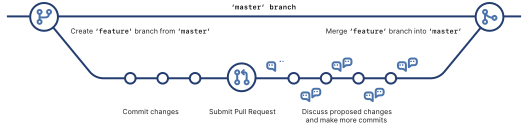

# Branching

## Overview of Git Branching

Show available branches:

```bash
(zmathenv) [apollo ~/pyschool]$ git branch
* master
```

The branch with an asterisk ("`*`") is the current branch.

Create a new branch called `dev-branch-typo`, which will be a development branch, 
and a typographical error (we show this to demonstrate how to delete a branch too), 
then list all the branches again:

```bash
(zmathenv) [apollo ~/pyschool]$ git branch
  dev-branch-typo
* master
```

Notice the `*` remained on `master` since we only *created* the `dev-branch-typo`
branch but did not check it out. 

Delete the errant branch and confirm it has been deleted.  

* The `-d` is git's safe delete, which prevents you from deleting 
a branch if it has unmerged changes.  
* Alternatively, the use of `-D` will force deletion of the specified branch, even if 
unmerged changes exist.  The `-D` is useful in the case when the developer wants 
to discard all commits on a particular branch.

```bash
(zmathenv) [apollo ~/pyschool]$ git branch -d dev-branch-typo
Deleted branch dev-branch-typo (was 186cfb4).
(zmathenv) [apollo ~/pyschool]$ git branch
* master
```

In practice, you will use the following *Branch Workflow*:

* Create a new development branch
* Develop and test the code
* Merge the development branch into the main code base
* Delete the development branch

Below is an example of that workflow on a tiny piece of code.

## Branch Workflow

```bash
(zmathenv) [apollo ~/pyschool]$ git branch dev-branch-test
(zmathenv) [apollo ~/pyschool]$ git branch
  dev-branch-test
* master
(zmathenv) [apollo ~/pyschool]$ git pull
Already up-to-date.
```

## Feature Branch Workflow

The feature branch pattern:

from the GitHub [cheat sheet](https://training.github.com/downloads/github-git-cheat-sheet.pdf).



In our case, we will create a specific `feature` called `dev-branch-test`.

```bash
(zmathenv) [apollo ~/pyschool]$ git checkout dev-branch-test
Switched to branch 'dev-branch-test'
(zmathenv) [apollo ~/pyschool]$ git branch
* dev-branch-test
  master
```

To **create** a new branch and check it out at the same time:

```bash
(zmathenv) [apollo ~/pyschool]$ git checkout -b dev-branch-test
```

Now create and test a simple `hello world` script, or a modification to the
documentation `configuration.md` as follows:

```bash
(zmathenv) [apollo ~/pyschool]$ git status
On branch dev-branch-test
Changes not staged for commit:
  (use "git add <file>..." to update what will be committed)
  (use "git checkout -- <file>..." to discard changes in working directory)

    modified:   zfolder/doc/configuration.md

Untracked files:
  (use "git add <file>..." to include in what will be committed)

    zfolder/doc/fig/

no changes added to commit (use "git add" and/or "git commit -a")
```

Using `git add` we add two files and see the status now here:

To come.

Then push the branch to the main local origin, and create a pull request.
 
## Create a pull request

To come.

## References

* [Learn Git](https://try.github.io/)
* [Learn Git Branching](https://learngitbranching.js.org/)
