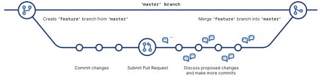

# Configuration

## Previous: [Learn](learn.md)

To set up your local development environment, install and then configure the 
the dev tools below.

## Installation

* Install [Git](https://git-scm.com/)
* Install [Visual Studio Code](https://code.visualstudio.com/)
* Install [Miniconda](https://docs.conda.io/en/latest/miniconda.html)
* Create a virtual environment called `zmathenv` and then activate that newly-created environment:

## Configuration

### Git Configuration

If not yet configured, your username and email are set as follows
and are used set for commit transactions:

```bash
(base) $ git config --global user.name "your-name-here"
(base) $ git config --global user.email "your-email@example.com"  
(base) $ git config --global color.ui auto  # colorize the command line interface 
```

* [Connect](https://docs.github.com/en/free-pro-team@latest/github/authenticating-to-github/connecting-to-github-with-ssh) local to GitHub repo via ssh.
* Clone the repo to local:

```bash
(base) $ git@github.com:hovey/pyschool.git
```

### Virtual Environment Configuration

A virtual environment ensures you will have all the necessary modules required to run the workflow, and that
the modules installed are compatable with each other.  First, check to make sure you don't already have a
virtual environment called `zmathenv` 

```bash
(base) $ conda env list
```

Create the virtual environment:

```bash 
(base) $ conda create --name zmathenv python=3.8 numpy matplotlib pytest pytest-cov flake8 black pylint
(base) $ conda activate zmathenv
(zmathenv) $
```

* Install the existing `zmath` library in developer mode:

```bash
(zmathenv) $ cd ~/pyschool
(zmathenv) $ # to come, ask Anirudh on this step.
```

## Overview of Git Branching

Show available branches:

```bash
(zmathenv) [apollo ~/pyschool]$ git branch
* master
```

The branch with an asterisk ("`*`") is the current branch.

Create a new branch called `dev-branch-typo`, which will be a development branch, 
and a typographical error (we show this to demonstrate how to delete a branch too), 
then list all the branches again:

```bash
(zmathenv) [apollo ~/pyschool]$ git branch
  dev-branch-typo
* master
```

Notice the `*` remained on `master` since we only *created* the `dev-branch-typo`
branch but did not check it out. 

Delete the errant branch and confirm it has been deleted.  

* The `-d` is git's safe delete, which prevents you from deleting 
a branch if it has unmerged changes.  
* Alternatively, the use of `-D` will force deletion of the specified branch, even if 
unmerged changes exist.  The `-D` is useful in the case when the developer wants 
to discard all commits on a particular branch.

```bash
(zmathenv) [apollo ~/pyschool]$ git branch -d dev-branch-typo
Deleted branch dev-branch-typo (was 186cfb4).
(zmathenv) [apollo ~/pyschool]$ git branch
* master
```

In practice, you will use the following *Branch Workflow*:

* Create a new development branch
* Develop and test the code
* Merge the development branch into the main code base
* Delete the development branch

Below is an example of that workflow on a tiny piece of code.

## Branch Workflow

```bash
(zmathenv) [apollo ~/pyschool]$ git branch dev-branch-test
(zmathenv) [apollo ~/pyschool]$ git branch
  dev-branch-test
* master
(zmathenv) [apollo ~/pyschool]$ git pull
Already up-to-date.
```

## Feature Branch Workflow

The feature branch pattern:

from the GitHub [cheat sheet](https://training.github.com/downloads/github-git-cheat-sheet.pdf).



In our case, we will create a specific `feature` called `dev-branch-test`.

```bash
(zmathenv) [apollo ~/pyschool]$ git checkout dev-branch-test
Switched to branch 'dev-branch-test'
(zmathenv) [apollo ~/pyschool]$ git branch
* dev-branch-test
  master
```

To **create** a new branch and check it out at the same time:

```bash
(zmathenv) [apollo ~/pyschool]$ git checkout -b dev-branch-test
```

Now create and test a simple `hello world` script, or a modification to the
documentation `configuration.md` as follows:

```bash
(zmathenv) [apollo ~/pyschool]$ git status
On branch dev-branch-test
Changes not staged for commit:
  (use "git add <file>..." to update what will be committed)
  (use "git checkout -- <file>..." to discard changes in working directory)

    modified:   zfolder/doc/configuration.md

Untracked files:
  (use "git add <file>..." to include in what will be committed)

    zfolder/doc/fig/

no changes added to commit (use "git add" and/or "git commit -a")
```

Using `git add` we add two files and see the status now here:


Then push the branch to the main local origin


, then create a pull request.
 
## Create a pull request


## References

* [Learn Git](https://try.github.io/)
* [Learn Git Branching](https://learngitbranching.js.org/)
## Overview of Git Branching

Show available branches:

```bash
(zmathenv) [apollo ~/pyschool]$ git branch
* master
```

The branch with an asterisk ("`*`") is the current branch.

Create a new branch called `dev-branch-typo`, which will be a development branch, 
and a typographical error (we show this to demonstrate how to delete a branch too), 
then list all the branches again:

```bash
(zmathenv) [apollo ~/pyschool]$ git branch
  dev-branch-typo
* master
```

Notice the `*` remained on `master` since we only *created* the `dev-branch-typo`
branch but did not check it out. 

Delete the errant branch and confirm it has been deleted.  

* The `-d` is git's safe delete, which prevents you from deleting 
a branch if it has unmerged changes.  
* Alternatively, the use of `-D` will force deletion of the specified branch, even if 
unmerged changes exist.  The `-D` is useful in the case when the developer wants 
to discard all commits on a particular branch.

```bash
(zmathenv) [apollo ~/pyschool]$ git branch -d dev-branch-typo
Deleted branch dev-branch-typo (was 186cfb4).
(zmathenv) [apollo ~/pyschool]$ git branch
* master
```

In practice, you will use the following *Branch Workflow*:

* Create a new development branch
* Develop and test the code
* Merge the development branch into the main code base
* Delete the development branch

Below is an example of that workflow on a tiny piece of code.

## Branch Workflow

```bash
(zmathenv) [apollo ~/pyschool]$ git branch dev-branch-test
(zmathenv) [apollo ~/pyschool]$ git branch
  dev-branch-test
* master
(zmathenv) [apollo ~/pyschool]$ git pull
Already up-to-date.
```


## Next: [Dev](dev.md)
